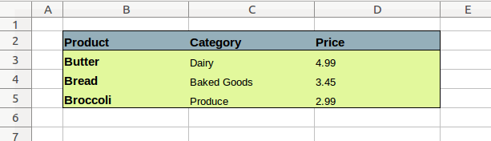

# axlsx_styler

[](https://rubygems.org/gems/axlsx_styler)
[](https://travis-ci.org/axlsx-styler-gem/axlsx_styler)

`axlsx_styler` is a gem that allows you to build clean and maintainable styles for your `axlsx` spreadsheets. Build your spreadsheeet with data and then apply styles later.

While [`axlsx`](https://github.com/randym/axlsx) is an excellent tool to build Excel spreadsheets in Ruby, the sheets styles are only applied immediately as the row is created. This makes it very difficult to style easily and effectively.

To solve this issue, `axlsx_styler` was born to allow the separatation of styles from content within your `axlsx` code. It gives you the ability to fill out a spreadsheet with data and apply styles later. 

Works well in any Rails app with [`axlsx_rails`](https://github.com/straydogstudio/axlsx_rails) or outside of any specific Ruby framework.

# Usage

This gem provides a DSL that allows you to apply styles or borders to ranges of cells.

## Styles

```ruby
sheet.add_style 'A1:D10', b: true, sz: 14
```

The styles can be overlayed, so that later on you can add another style to cells that already have styles.

```ruby
sheet.add_style 'A1:D1', bg_color: 'FF0000'
```

Applying multiple styles as a sequence of Ruby hashes is also possible.

```ruby
bold     = { b: true }
centered = { alignment: { horizontal: :center } }
sheet.add_style 'A2:D2', bold, centered
```

## Borders

The border style is to draw a thin black border on all four edges of the selected cell range.

```ruby
sheet.add_border 'B2:D5'
```

You can easily customize the border styles.

```ruby
sheet.add_border 'B2:D5', [:bottom, :right]
sheet.add_border 'B2:D5', { edges: [:bottom, :right], style: :thick, color: 'FF0000' }
```


## Example

Suppose we want create the following spreadsheet:



You can apply styles after all data is entered, similar to how you'd create an Excel document by hand.

```ruby
require 'axlsx_styler'

axlsx = Axlsx::Package.new
workbook = axlsx.workbook
workbook.add_worksheet do |sheet|
  sheet.add_row
  sheet.add_row ['', 'Product', 'Category',  'Price']
  sheet.add_row ['', 'Butter', 'Dairy',      4.99]
  sheet.add_row ['', 'Bread', 'Baked Goods', 3.45]
  sheet.add_row ['', 'Broccoli', 'Produce',  2.99]
  sheet.column_widths 5, 20, 20, 20

  # using AxlsxStyler DSL
  sheet.add_style 'B2:D2', b: true
  sheet.add_style 'B2:B5', b: true
  sheet.add_style 'B2:D2', bg_color: '95AFBA'
  sheet.add_style 'B3:D5', bg_color: 'E2F89C'
  sheet.add_style 'D3:D5', alignment: { horizontal: :left }
  sheet.add_border 'B2:D5'
  sheet.add_border 'B3:D3', [:top]
end
axlsx.serialize 'grocery.xlsx'
```

If you try creating this same spreadsheet using only `axlsx`, you will find this is much more difficult. See this [See this example](./examples/vanilla_axlsx.md)

For more examples, please see the [examples folder](./examples/)

# Contributing

We use the `appraisal` gem for testing multiple versions of `axlsx`. Please use the following steps to test using `appraisal`.

1. `bundle exec appraisal install`
2. `bundle exec appraisal rake test`

# Credits

Created by Anton Sakovich - @sakovias

Maintained by Weston Ganger - @westonganger - Currently utilizing `axlsx_styler` within the [spreadsheet_architect](https://github.com/westonganger/spreadsheet_architect) gem
